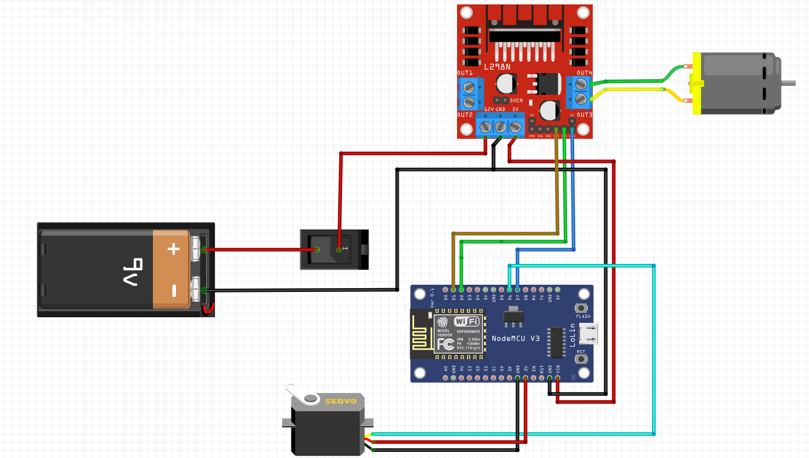

# Carrinho controlado via Wi-Fi
> Alunos: Afonso Salvador de Magalhães, Diogo Delazare Brandão e Thamya Vieira Hashimoto Donadia   
Mostra Projeto Integrador em Computação I - 2021.2  
Universidade Federal do Espírito Santo (UFES) 

## Descrição do projeto 
&nbsp;&nbsp;&nbsp;&nbsp;&nbsp;&nbsp; Carrinho de controle remoto, utilizando o módulo Wi-Fi da placa ESP8266 e operado por uma aplicação web voltada para dispositivos móveis. 

## Materiais utilizados 
**1. Componentes para a montagem física**
   - Módulo Wi-Fi ESP8266
   - Driver Ponte H L298N
   - 1x Motor DC/CC
   - 1x Servo motor 
   - Protoboard 
   - Jumpers
   - Conector de bateria 9V
   - Estrutura de um carrinho de brinquedo 

**2. Softwares**
   - Arduino IDE
   - Fritzing
    
## Hardware - Montagem do circuito 
**1. Esquemático e explicação das conexões**  
&nbsp;&nbsp;&nbsp;&nbsp;&nbsp;&nbsp;Abaixo temos as conexões realizadas para montar o carrinho. O motor CC/DC é conectado ao driver e utilizado para movimentar o carrinho para frente ou para trás. Os pinos de input (IN1, IN2, IN3, IN4) do driver são conectados aos pinos digitais do ESP e são utilizados para determinar as direções de movimento dos motores CC/DC. Já os pinos ENABLE (ENA, ENB) são conectados aos pinos PWM do ESP para controlar a velocidade de rotação dos motores. Nosso projeto utiliza apenas um motor CC, controlado pela interface do motor B do driver (IN3, IN4, ENB). Por outro lado, o servo motor foi conectado a um pino PWM do ESP, de modo que é possível controlar a angulação das rodas através de um pivô.  



**2. Montagem física**  
&nbsp;&nbsp;&nbsp;&nbsp;&nbsp;&nbsp;O sistema foi montado por cima da base do chassi de um antigo carrinho de brinquedo, aproveitando seus eixos de roda e seu interruptor para ligá-lo e desligá-lo. O motor CC/DC é colocado na parte de trás do carrinho e conectado ao eixo traseiro através de um sistema de engrenagens, já o servo motor é responsável pela movimentação direcional do eixo dianteiro.  
&nbsp;&nbsp;&nbsp;&nbsp;&nbsp;&nbsp;O motor CC/DC está conectado nos terminais do motor B do driver. O driver ponte H está sendo alimentado através de uma bateria 9V ligada a seus terminais VCC (que aceita tensões entre 6V e 12V) e GND. Note que a bateria é a única fonte de alimentação da placa, não havendo uma fonte de alimentação de 5V independente para o circuito interno da mesma. Desse modo, o jumper 5V, localizado próximo aos terminais do motor A na placa, deve ser mantido.  
&nbsp;&nbsp;&nbsp;&nbsp;&nbsp;&nbsp;O servomotor foi posicionado de forma que a sua rotação movimente a haste responsável pela rotação das rodas dianteiras, empurrando um pino no centro dessa haste para a esquerda ou direita. É importante que o posicionamento do servo seja preciso, de forma que consiga movimentar a haste uma boa distância para ambos os lados. Há outras formas de implementar a rotação do eixo dianteiro como, por exemplo, acoplar um trilho dentado à haste e uma engrenagem ao eixo do servo. No entanto, essa opção se mostrou mais complexa que a escolhida acima.  
&nbsp;&nbsp;&nbsp;&nbsp;&nbsp;&nbsp;A placa ESP foi conectada ao driver dos motores e ao servomotor. A sua alimentação é feita através de sua entrada USB-C, conectada a uma fonte USB portátil, e seu pino GND foi conectado ao negativo da bateria para que ambas placas tivessem a mesma referência de tensão. Ambas placas foram presas ao chassi do carrinho através de parafusos.  

## Software - Explicação do código  
&nbsp;&nbsp;&nbsp;&nbsp;&nbsp;&nbsp;A priori, foi necessário configurar a IDE do Arduino para programar o ESP8266. Isso foi feito adicionando a URL "http://arduino.esp8266.com/stable/package_esp8266com_index.json" ao campo "URLs Adicionais para Gerenciadores de Placas" na janela de preferências do Arduino IDE (Arquivo -> Preferências / Ctrl + ,) e escolhendo a placa correta no menu de Ferramentas (Ferramentas -> Placa -> ESP8266 Boards -> NodeMCU 1.0 (ESP-12E Module)).
Além disso, foi instalada as bibliotecas ```Servo.h```, para facilitar o controle do servomotor, bem como  ```ESP8266WiFi.h``` e ```ESP8266WebServer.h``` para configurar o módulo Wi-Fi da placa ESP.  

**1. Código para controlar os motores**  
&nbsp;&nbsp;&nbsp;&nbsp;&nbsp;&nbsp;No início do código, foram definidas constantes para nomear os pinos aos quais estão conectados o servo motor e o motor CC/DC, a velocidade de atuação do motor e a angulação de giro do servo. Para controlar o motor CC/DC foi utilizada a tabela lógica abaixo, que define o estado e o sentido de giro do motor baseado nos níveis lógicos dos terminais IN3 e IN4, de modo que o carrinho se movimente para frente, para trás ou fique parado.  

|  IN3  |  IN4  | Resultado |
|-------|-------|-----------|
|  High |  Low  | Frente    |
|  Low  |  High | Trás      |
|  Low  |  Low  | Parado    |
|  High |  High | Parado    |

&nbsp;&nbsp;&nbsp;&nbsp;&nbsp;&nbsp;A velocidade do carrinho pode ser ajustada através da macro ```velocidadeMotor``` no código. Seu valor pode variar entre 0 e 1023, correspondendo, proporcionalmente, a 0% e 100% do Duty Cycle do motor. Basicamente, quanto maio for este número, mais tempo o motor permanecerá alimentado a cada segundo e maior sua potência e velocidade.  
&nbsp;&nbsp;&nbsp;&nbsp;&nbsp;&nbsp;Para fazer o carrinho virar para um lado ou outro, foi utilizada a biblioteca ```Servo.h``` para controlar o servo motor. Desse modo, foi definida uma angulação base para ele virar para a esquerda ou para a direita. É importante notar que o servo motor utilizado trabalha com ângulos entre 0° e 180°, sendo seu ponto médio de giro 90°. No entanto, não é recomendado trabalhar com as extremidades desse limiar, pois isso pode causar problemas ao servomotor. Por fim, utilizou-se a função ```Servo.write(angulo)``` da própria biblioteca para aplicar a angulação de giro no servo motor.  

**2. Conexão Wi-Fi**  
&nbsp;&nbsp;&nbsp;&nbsp;&nbsp;&nbsp;O ESP foi utilizado no modo "ponto de acesso (AP)", permitindo que outros dispositivos se conectassem a ele através de uma rede Wi-Fi gerada pelo próprio. No começo do código, são definidos o endereço IP local, gateway padrão e máscara de subrede do ponto de acesso, além de SSD e senha da rede. Também é criado um servidor ```server```, escutando requisições na porta 80.  
&nbsp;&nbsp;&nbsp;&nbsp;&nbsp;&nbsp;Em seguida são definidos os comportamentos da placa ao receber requisições HTTP_GET em diferentes endereços. O recebimento de uma requisição em um determinado endereço chamará uma função que fará o controle dos motores de acordo com o endereço requisitado e retornará ao cliente uma página HTTP. Os comandos podem ser: posicionar o servomotor para a esquerda, para o meio ou para a direita; girar o motor CC para frente, para trás ou pará-lo.  
&nbsp;&nbsp;&nbsp;&nbsp;&nbsp;&nbsp;O servidor é então iniciado e o ESP passa a funcionar como um ponto de acesso Wi-Fi. Ao conectar um dispositivo à rede do ESP e acessar o seu endereço IP local (definido no código por padrão como 192.168.4.1) através de um navegador de internet, este exibirá uma página com 6 botões que, quando pressionados, farão requisições nos respectivos endereços para enviar comandos ao carrinho.
